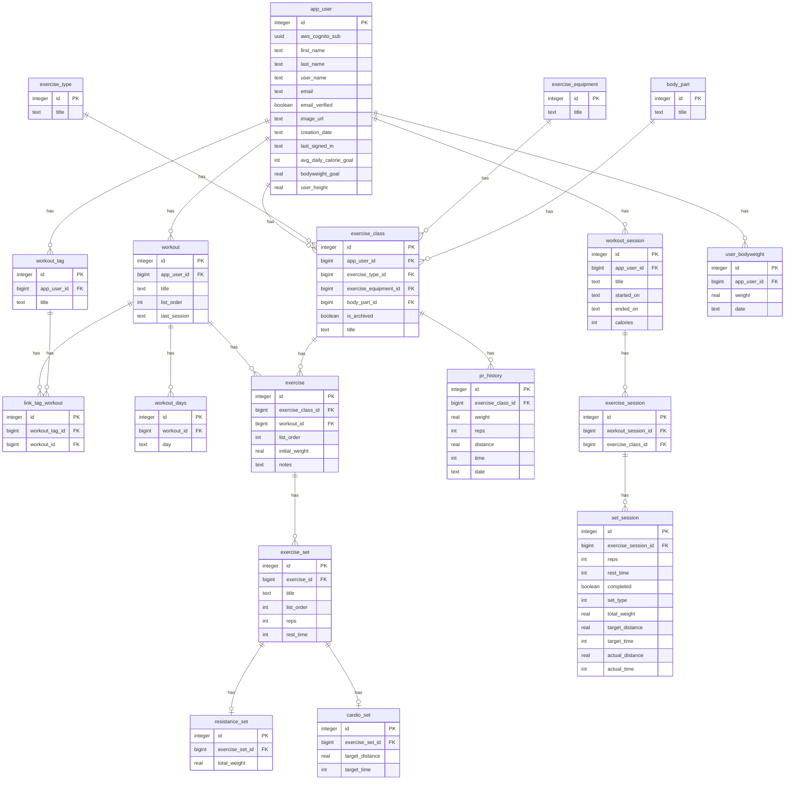

# Resistance Training App

## Features :pencil2:

- Build your own custom workout templates
- Choose from a variety of built-in exercises or make your own!
- Graph your calories burned, body weight, and more
- Track your PRs (Personal Records)
- View your workout history

## Screenshots :camera:

### See the designs on [Figma](https://www.figma.com/design/agfI7UZ5xe542eTNCxVpqs/Workout-Scheduler?node-id=594-209&node-type=CANVAS)

## DB Schema :scroll:

If you get the data model right...

## In Progress :memo:

- Integrate active workout session
- Make plate based weight calculator
- Revamp the Summary Page w/ improved graphs
